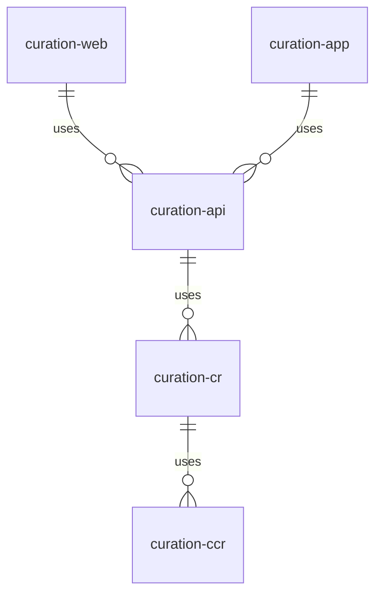

# Clarin Curation Dashboard
## Introduction
Curation Dashboard is a service originally developed by the technical team of the [ACDH-CH](https://www.oeaw.ac.at/acdh) hosted and maintained by
[CLARIN-ERIC](https://www.clarin.eu/). Its goal is to support CMD metadata authors and curators to improve quality of metadata for language resources. More information:

* [CMD -Component Metadata](https://www.clarin.eu/content/component-metadata) - the CLARIN metadata framework.
* [Code on Github](https://github.com/clarin-eric/curation-dashboard)
* [CLARIN-PLUS deliverable D2.1](https://office.clarin.eu/v/CE-2016-0742-CLARINPLUS-D2_1.pdf) - specification document for the Curation Dashboard from 2016, formulated in the context of [CLARIN-PLUS](https://www.clarin.eu/content/factsheet-clarin-plus) project.

The goal of this project is to implement software component for curation and quality assessment which can be integrated in the CLARINs VLO workflow. Project is initialized by Metadata Curation Task Force. Specification for the Curation Dashboard is based on the Metadata Quality Assessment Service proposal. Curation Dashboard validates and normalizes single MD records, repositories and profiles, to assess their quality and to produce reports with different information for different actors in VLO workflow. For implementation this project will use some of the existing CLARIN components. 

## Modularized project structure

### curation-web
The curation-web module is the web application known the end-user as [»curation dashboard«](https://curation.clarin.eu/).
Aside from the fact that it allows the user to upload single profiles or CMD instances for immediate analysis and the download of
link checking results in different formats, curation-web is only a dump application to serve static reports which
have been generated by the curation-api module.

### curation-app
The curation-app module is a stand-alone application which uses the curation-api to generate profile reports, CMD collection
reports and link checker reports and stores these reports as XML and HTML in the file system. These are the static files
later on served by curation-web.

### curation-api
The curation API is the central unit to process schema (profiles), CMD instances and whole collections of CMD instances.
As a result of the processing it generates static reports on the quality of profiles and CMD instances. Further on it
extracts web links from the CMD files, writes the to a database which is used for permanent link checking and enriches
the reports by the latest link checking statistics.

### curation-cr
The CR service is managing instances of ProfileCacheEntry. A ProfileCacheEntry is a Java object, which contains all
xpaths to elements and attributes of implementations of a specific schema (profile), on other words the CMD files
based on the schema.
An addition to this the ProfileCacheEntry contains an instance of Schema, which is the Java representation of an XML schema.

### curation-ccr
The CCR service is managing instances of CCRConcept. A CRRConcept is a Java object which contains information on URI,
preferred label and status of a specific concept.

